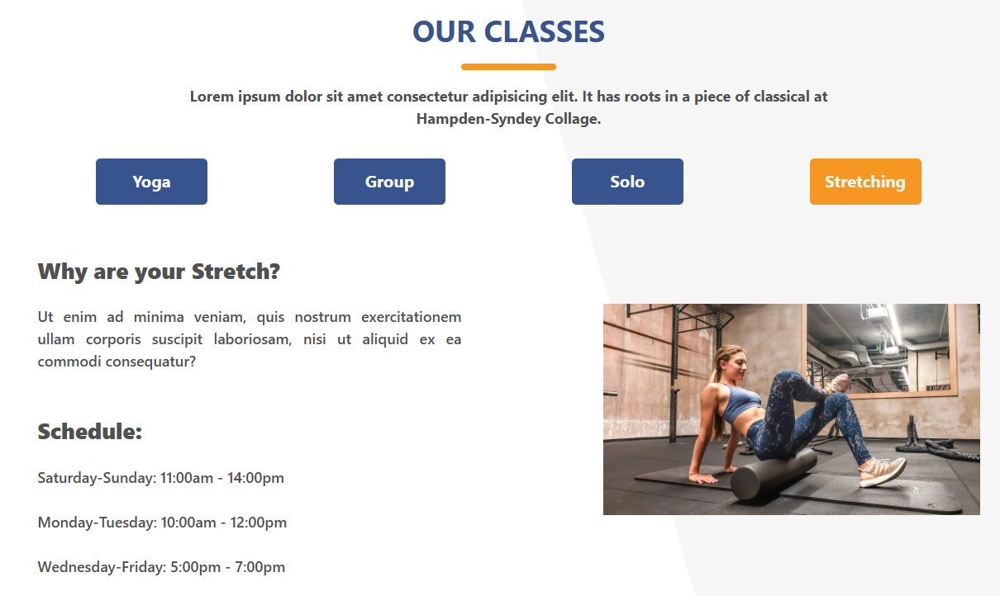
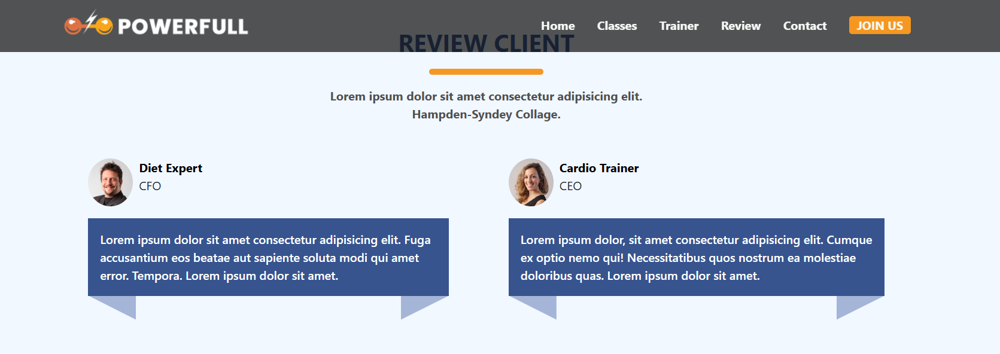
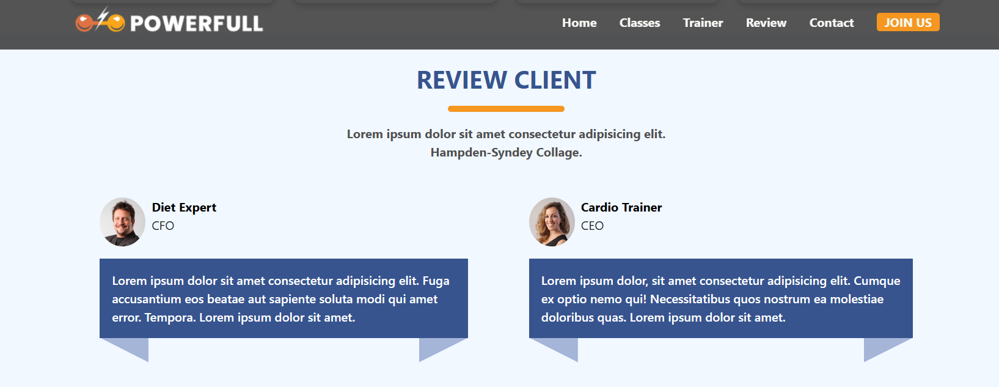

# 🏋🏽 Sport Center Website Project | React

[🇹🇷 Click for Turkish README](./README.tr.md)

*Created: April 8, 2025*

- This project was developed as the **Week-9 / React - Sport Center** assignment for the Patika Frontend Bootcamp.
- It is a rewrite of the Week 8 vanilla JS project using React component architecture.
- A modern, fully responsive, and user-friendly fitness center web application.
- Built with **React 19**, **Vite**, **HTML5**, **CSS3**, **Bootstrap 5**, and **FontAwesome**.
- Developed with component-based architecture, dynamic state management, and modern UI/UX principles.

---

## 🚀 Live Demo

Visit the live website: [Sport Center | Reactjs](https://sport-center-reactjs.vercel.app/)

---

## :computer: Installation & Usage

1. Clone the repository:
```bash
git clone https://github.com/tunahanyasar/sport-center-reactjs.git
```
2. Go to the project folder:
```bash
cd sport-center-reactjs
```
3. Install dependencies:
```bash
npm install
```
4. Start the development server:
```bash
npm run dev
```
5. Open in your browser: [http://localhost:5173](http://localhost:5173)

---

## 📁 Project Structure

:open_file_folder: **Folders and Files:**

- **src/**
  - **components/**: All React components
    - Navbar.jsx: Fixed and dynamic menu, mobile-friendly hamburger menu
    - Hero.jsx: Main section with background image and call-to-action
    - CourseInfo.jsx: Course, training, hours, and customer statistics
    - OurCourses.jsx: Four course types, animated transitions, and program details
    - BMICalculator.jsx: Dynamic body mass index calculator, visual indicator
    - Trainers.jsx: Trainer cards, images, and branch info
    - Shop.jsx: Equipment sales cards, prices, and "Add to Cart" buttons
    - Comments.jsx: Customer reviews, avatars, and titles
    - Contact.jsx: Contact form, validation, Google Maps integration
    - Footer.jsx: Info and links, logo
  - **assets/**
    - **img/**: All images (hero, trainers, products, avatars, etc.)
    - **screenshots/**: Screenshots (full-page, responsive, bmi, trainers, etc.)
  - **styles/**
    - main.css: All custom and responsive CSS
  - App.jsx, main.jsx, index.css
- **index.html**: Bootstrap, Google Fonts, FontAwesome CDNs
- **package.json**: Project dependencies and scripts

---

## :star2: Key Features

- **Fully Responsive Design**
  - Mobile, tablet, and desktop compatibility ([Full Page Screenshot](./src/assets/screenshots/full-page.png))
  - Mobile dropdown menu and optimized layout ([Responsive Screenshot](./src/assets/screenshots/responsive-575px.png))
- **Modern UI/UX**
  - Wide section backgrounds, animated transitions ([Header Animation 1](./src/assets/screenshots/header-content-1.png), [Header Animation 2](./src/assets/screenshots/header-content-2.png))
  - Hover effects, smooth scroll, sticky navbar ([Header 1](./src/assets/screenshots/header-1.png), [Header 2](./src/assets/screenshots/header-2.png))
  - Modern color palette and typography
- **Interactive Components**
  - **BMI Calculator:** Takes user height/weight, calculates BMI, and displays visually ([BMI Calculator Screenshot](./src/assets/screenshots/bmi-calc.png))
  - **Courses:** Four course types, animated transitions ([Courses Screenshot 1](./src/assets/screenshots/classes-1.png), [Courses Screenshot 2](./src/assets/screenshots/our-classes-2.png))
  - **Trainers:** Trainers and their branches in card structure ([Trainers Screenshot](./src/assets/screenshots/trainers.png))
  - **Equipment Sales:** Product cards, prices, and add to cart buttons (for demo purposes)
  - **Comments:** Real customer avatars and reviews
  - **Contact:** Form, validation, and Google Maps integration
- **Technical Details**
  - React Hooks (useState, useEffect, useRef)
  - Component-based architecture
  - Bootstrap 5 grid and layout
  - Fast development environment with Vite
  - FontAwesome icons
  - Custom typography with Google Fonts
  - Modern CSS (Flexbox, Grid, Media Queries, Custom Properties)
  - Smooth scroll and sticky navbar

---

## 🛠️ Technologies Used

- **React 19**
- **Vite**
- **JavaScript (ES6+)**
- **HTML5**
- **CSS3**
- **Bootstrap 5** (CDN)
- **FontAwesome** (for icons)
- **Google Fonts** (custom typography)
- **Responsive Design** (Flexbox, Grid, Media Queries)
- **Git & GitHub**

---

## 🎯 Project Goals & Outcomes

- Apply component-based architecture with React
- Develop a responsive and modern interface
- Create interactive components to increase user engagement
- Implement real-world scenarios like form validation and map integration
- Combine Bootstrap and modern CSS techniques

---

## 🖼️ Screenshots

### Full Page View


### Responsive (575px) View


### Trainers Section


### BMI Calculator


### Classes (Courses) - 1


### Classes (Courses) - 2


### Header Content - 1


### Header Content - 2


### Header - 1


### Header - 2


---

## 📞 Contact

[Tunahan Yaşar](https://github.com/tunahanyasar)

* GitHub: [@tunahanyasar](https://github.com/tunahanyasar)
* LinkedIn: [Tunahan Yaşar](https://www.linkedin.com/in/tunahan-yasar/)