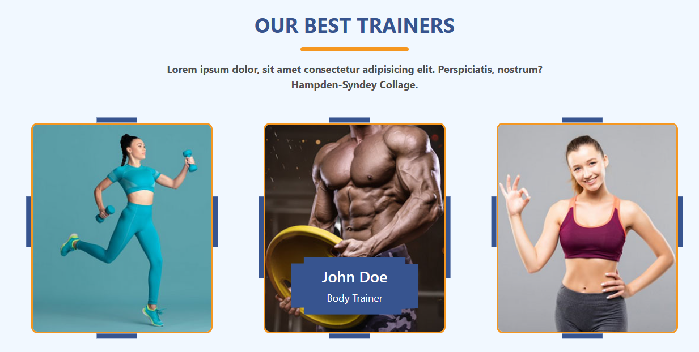
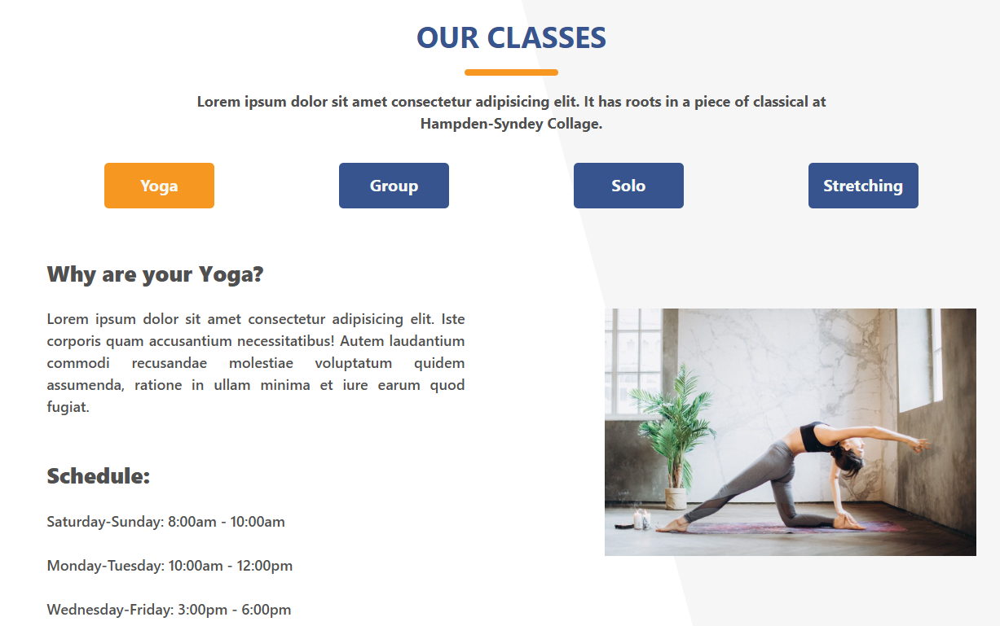
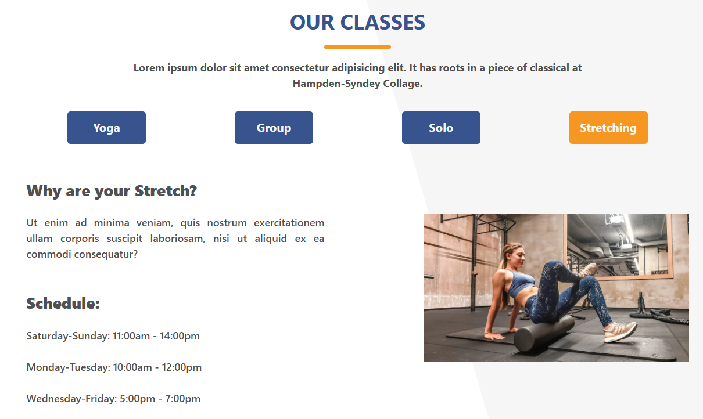
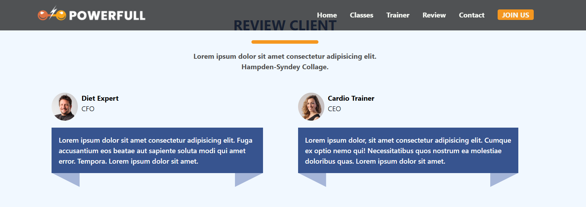
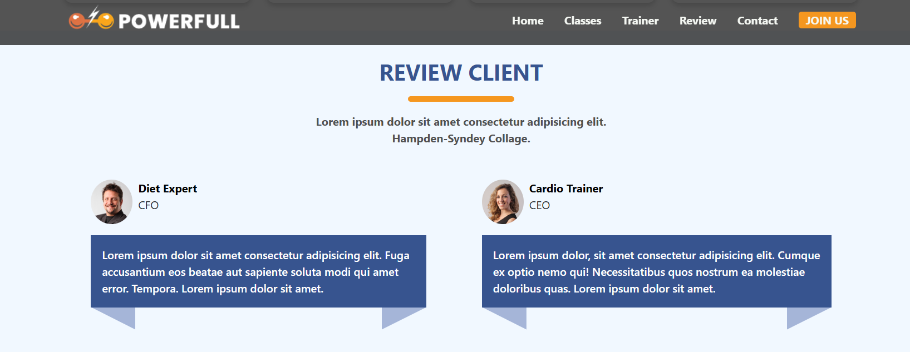
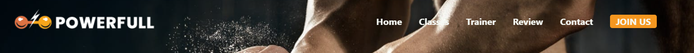
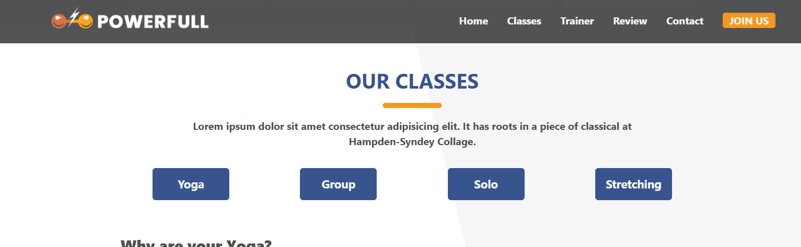

# 🏋🏽 Sport Center Website Projesi | React

[🇬🇧 İngilizce README için tıklayın](./README.md)

*Oluşturulma Tarihi : 8 Nisan 2025*

- Bu proje, Patika Frontend Bootcamp'i kapsamında **Hafta-9 / Final Projesi 1.1 | React - Sport Center** ödevi olarak geliştirilmiştir. [@sport-center-vanillajs](https://github.com/tunahanyasar/sport-center-vanillajs) adresindeki orijinal projemin React.js ile yeniden kodlanmış halidir.
- Patika Frontend Bootcamp'i kapsamında **Hafta-9 / React - Sport Center** ödevi olarak geliştirilmiştir.
- 
- Hafta 8'de yapılan vanilla JS projesinin React component mimarisiyle yeniden yazılmış halidir.
- Modern, tamamen responsive ve kullanıcı dostu bir fitness merkezi web uygulamasıdır.
- **React 19**, **Vite**, **HTML5**, **CSS3**, **Bootstrap 5** ve **FontAwesome** kullanılmıştır.
- Proje, component tabanlı mimari, dinamik state yönetimi ve modern UI/UX prensipleriyle geliştirilmiştir.

---

## 🚀 Canlı Demo


Canlı web sitesini ziyaret edin : [Sport Center | Reactjs](https://sport-center-reactjs.vercel.app/)

---

## :computer: Kurulum ve Kullanım

1. Projeyi klonlayın:
```bash
git clone https://github.com/tunahanyasar/sport-center-reactjs.git
```
2. Proje klasörüne gidin:
```bash
cd sport-center-reactjs
```
3. Bağımlılıkları yükleyin:
```bash
npm install
```
4. Geliştirme sunucusunu başlatın:
```bash
npm run dev
```
5. Tarayıcıda açın: [http://localhost:5173](http://localhost:5173)

---

## 📁 Proje Yapısı

:open_file_folder: **Klasörler ve Dosyalar:**

- **src/**
  - **components/**: Tüm React bileşenleri
    - Navbar.jsx: Sabit ve dinamik menü, mobil uyumlu hamburger menü
    - Hero.jsx: Arka plan görselli, çağrıya teşvik eden ana bölüm
    - CourseInfo.jsx: Kurs, antrenman, saat ve müşteri istatistikleri
    - OurCourses.jsx: Dört farklı kurs türü, animasyonlu geçiş ve program detayları
    - BMICalculator.jsx: Dinamik vücut kitle indeksi hesaplayıcı, görsel gösterge
    - Trainers.jsx: Eğitmen kartları, görseller ve branş bilgileri
    - Shop.jsx: Ekipman satış kartları, fiyat ve "Add to Cart" butonları
    - Comments.jsx: Müşteri yorumları, avatar ve unvanlar
    - Contact.jsx: İletişim formu, validasyon, Google Maps entegrasyonu
    - Footer.jsx: Bilgi ve linkler, logo
  - **assets/**
    - **img/**: Tüm görseller (hero, eğitmenler, ürünler, avatarlar, vb.)
    - **screenshots/**: Ekran görüntüleri (full-page, responsive, bmi, trainers, vb.)
  - **styles/**
    - main.css: Tüm özel ve responsive CSS
  - App.jsx, main.jsx, index.css
- **index.html**: Bootstrap, Google Fonts, FontAwesome CDN'leri
- **package.json**: Proje bağımlılıkları ve scriptler

---

## :star2: Temel Özellikler

- **Tamamen Responsive Tasarım**
  - Mobil, tablet ve masaüstü uyumluluğu ([Tam Sayfa Görseli](./src/assets/screenshots/full-page.png))
  - Mobilde açılır menü ve optimize edilmiş layout ([Responsive Görsel](./src/assets/screenshots/responsive-575px.png))
- **Modern UI/UX**
  - Geniş section arka planları, animasyonlu geçişler ([Header Animasyon 1](./src/assets/screenshots/header-content-1.png), [Header Animasyon 2](./src/assets/screenshots/header-content-2.png))
  - Hover efektleri, smooth scroll, sticky navbar ([Header 1](./src/assets/screenshots/header-1.png), [Header 2](./src/assets/screenshots/header-2.png))
  - Modern renk paleti ve tipografi
- **İnteraktif Bileşenler**
  - **BMI Hesaplayıcı:** Kullanıcıdan boy/kilo alır, BMI hesaplar ve görselde gösterir ([BMI Hesaplayıcı Görseli](./src/assets/screenshots/bmi-calc.png))
  - **Kurslar:** Dört farklı kurs türü, butonlarla animasyonlu geçiş ([Kurslar Görseli 1](./src/assets/screenshots/classes-1.png), [Kurslar Görseli 2](./src/assets/screenshots/our-classes-2.png))
  - **Eğitmenler:** Kart yapısında eğitmenler ve branşları ([Eğitmenler Görseli](./src/assets/screenshots/trainers.png))
  - **Ekipman Satışı:** Ürün kartları, fiyatlar ve sepete ekle butonları (demo amaçlı)
  - **Yorumlar:** Gerçek müşteri avatarları ve yorumları
  - **İletişim:** Form, validasyon ve Google Maps entegrasyonu
- **Teknik Detaylar**
  - React Hooks (useState, useEffect, useRef)
  - Component-based architecture
  - Bootstrap 5 ile grid ve layout
  - Vite ile hızlı geliştirme ortamı
  - FontAwesome ikonları
  - Google Fonts ile özel tipografi
  - Modern CSS (Flexbox, Grid, Media Queries, Custom Properties)
  - Smooth scroll ve sticky navbar

---

## 🛠️ Kullanılan Teknolojiler

- **React 19**
- **Vite**
- **JavaScript (ES6+)**
- **HTML5**
- **CSS3**
- **Bootstrap 5** (CDN)
- **FontAwesome** (ikonlar için)
- **Google Fonts** (özel tipografi)
- **Responsive Design** (Flexbox, Grid, Media Queries)
- **Git & GitHub**

---

## 🎯 Proje Hedefleri ve Kazanımlar

- React ile component tabanlı mimariyi uygulamak
- Responsive ve modern bir arayüz geliştirmek
- Kullanıcı etkileşimini artıran interaktif bileşenler oluşturmak
- Form validasyonu ve harita entegrasyonu gibi gerçek dünya senaryolarını uygulamak
- Bootstrap ve modern CSS tekniklerini birleştirmek

---

## 🖼️ Ekran Görüntüleri

### Tam Sayfa Görünümü


### Responsive (575px) Görünüm


### Eğitmenler Bölümü


### BMI Hesaplayıcı


### Sınıflar (Kurslar) - 1


### Sınıflar (Kurslar) - 2


### Header İçeriği - 1


### Header İçeriği - 2


### Header - 1


### Header - 2


---

## 📞 İletişim

[Tunahan Yaşar](https://github.com/tunahanyasar)

* GitHub: [@tunahanyasar](https://github.com/tunahanyasar)
* LinkedIn: [Tunahan Yaşar](https://www.linkedin.com/in/tunahan-yasar/)
